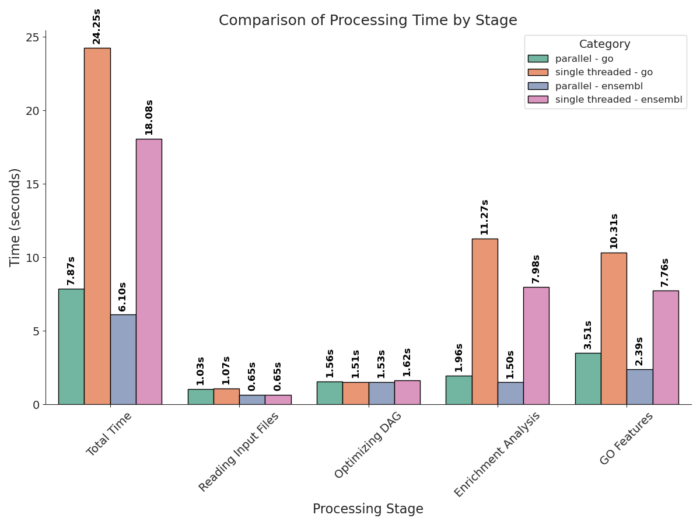

# Genomorientierte Bioinformatik - Assignment 5
When performing `Enrichment Analysis` in bioinformatics, there are several different tools and methods available 
to determine whether certain gene sets are statistically enriched. 
These tools usually approach this problem in different ways, using different statistical tests and assumptions.
The two main methods are `Gene Set Over-representation Analysis (ORA)` and `Gene Set Enrichment Analysis (GSEA)`.
This report compares a custom Java implementation of both methods for a given list of differentially expressed genes and a standard of truth gene set,
with two already existing tools, called [gProfiler](https://biit.cs.ut.ee/gprofiler/gost) `(perfoms ORA)` and [fgsea](https://bioconductor.org/packages/release/bioc/html/fgsea.html) `(performs GSEA)`.
The Java implementation is also evaluated in terms of runtime and the properties of the `Directed Acyclic Graph (DAG)` used for the analysis.

See [Report](./report/go_enrichment.pdf)

## Usage 
```bash
java -jar go_enrichment.jar
  -obo                   # Path to obo file.
  -root                  # One of three Ontology Terms: ["molecular_function", "biological_process", "cellular_component"].
  -mapping               # Path to mapping file (SYMBOL -> GO_ID).
  -mappingtype           # Format of the mapping-File (go|ensembl). Has to agree with "-mapping" option.
  [-overlapout]          # Information about DAG  entries  with shared mapped genes is written into this file.
  -enrich                # Path to enrichment analysis file.
  -o                     # Path to output file.
  -minsize               # Min amount of genes per GO entry.
  -maxsize               # Max amount of genes per GO entry.

```
## File Formats

### Obo
```
[Term]
id: GO:0000001
name: mitochondrion inheritance
namespace: biological_process
def: "The distribution of mitochondria, including the mitochondrial genome, into daughter cells after mitosis or meiosis, mediated by interactions between mitochondria and the cytoskeleton." [GOC:mcc, PMID:10873824, PMID:11389764]
synonym: "mitochondrial inheritance" EXACT []
is_a: GO:0048308 ! organelle inheritance
is_a: GO:0048311 ! mitochondrion distribution

[Term]
id: GO:0000002
...
```

### Mapping File GO Mapping
```
UniProtKB	A0A024R161	DNAJC25-GNG10		GO:0004871	GO_REF:0000038	IEA	UniProtKB-KW:KW-0807	F	Guanine nucleotide-binding protein subunit gamma	A0A024R161_HUMAN|DNAJC25-GNG10|hCG_1994888	protein	taxon:9606	20161126	UniProt		
UniProtKB	A0A024R161	DNAJC25-GNG10		GO:0005834	GO_REF:0000002	IEA	InterPro:IPR001770|InterPro:IPR015898	C	Guanine nucleotide-binding protein subunit gamma	A0A024R161_HUMAN|DNAJC25-GNG10|hCG_1994888	protein	taxon:9606	20161126	InterPro		
UniProtKB	A0A024R161	DNAJC25-GNG10		GO:0007186	GO_REF:0000002	IEA	InterPro:IPR001770|InterPro:IPR015898	P	Guanine nucleotide-binding protein subunit gamma	A0A024R161_HUMAN|DNAJC25-GNG10|hCG_1994888	protein	taxon:9606	20161126	InterPro		
UniProtKB	A0A075B6P5	IGKV2-28		GO:0002250	GO_REF:0000037	IEA	UniProtKB-KW:KW-1064	P	Immunoglobulin kappa variable 2-28	KV228_HUMAN|IGKV2-28	protein	taxon:9606	20161126	UniProt		
...
```

### Mapping File Ensembl Mapping
```
ensembl	hgnc	gos
ENSG00000111704	NANOG	GO:0000122|GO:0001158|GO:0001710|GO:0001714|GO:0003677|GO:0003682|GO:0003700|GO:0003714|GO:0005515|GO:0005634|GO:0005654|GO:0005730|GO:0006351|GO:0006355|GO:0008283|GO:0008284|GO:0008406|GO:0009790|GO:0009880|GO:0010033|GO:0010454|GO:0010468|GO:0017145|GO:0019827|GO:0030154|GO:0030514|GO:0032526|GO:0035019|GO:0043565|GO:0044212|GO:0045595|GO:0045596|GO:0045893|GO:0045931|GO:0045944|GO:0048863
ENSG00000136059	VILL	GO:0003779|GO:0005200|GO:0007010|GO:0015629|GO:0051693
ENSG00000033011	ALG1	GO:0000030|GO:0004578|GO:0005783|GO:0005789|GO:0006486|GO:0006488|GO:0009058|GO:0009103|GO:0016021|GO:0016757|GO:0018279|GO:0043687|GO:0044267|GO:0097502
...
```
### Enrichment File
```
#GO:0051051   (true go ids)
#GO:0048511
...
id	fc	signif
DNAJC25-GNG10	-1.3420	false
IGKV2-28	-2.3961	false
IGHV3-64	0.6092	false
IGKV2D-30	-0.2356	false
...
```

## Runtime

